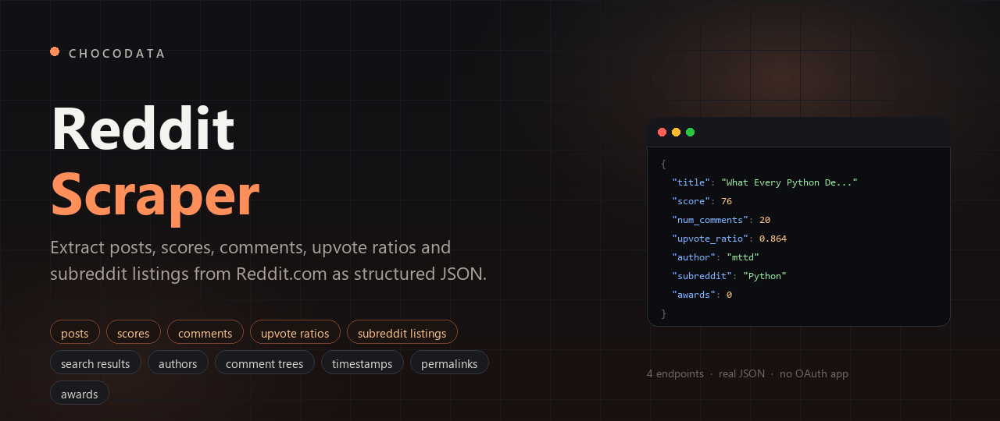
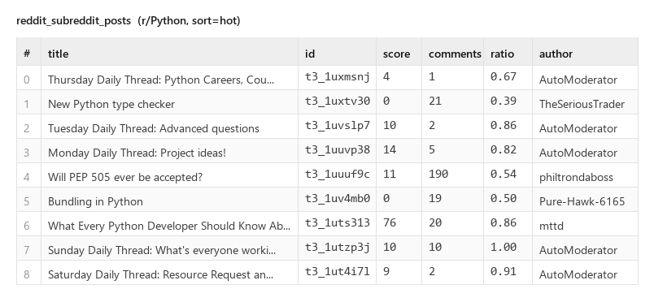
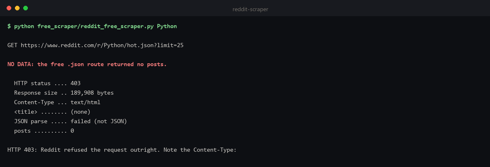
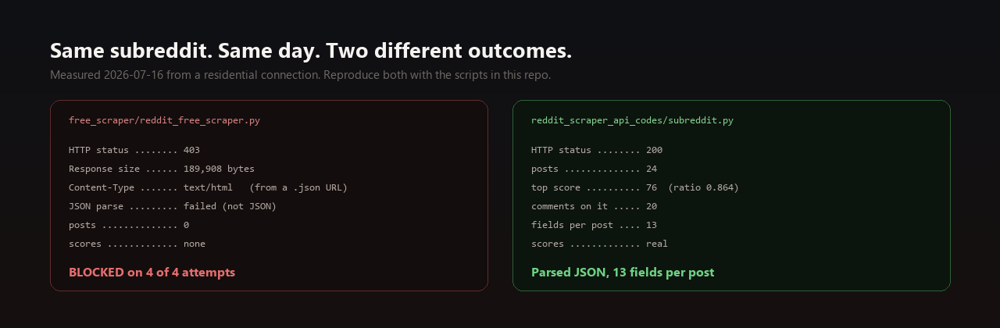
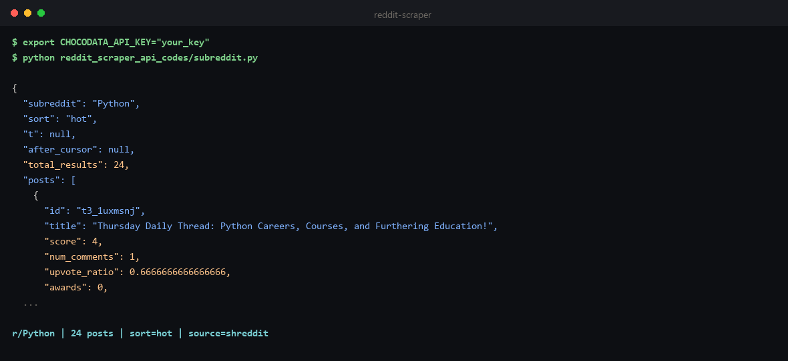
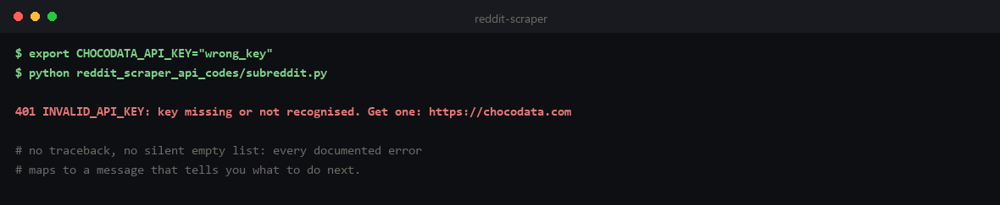
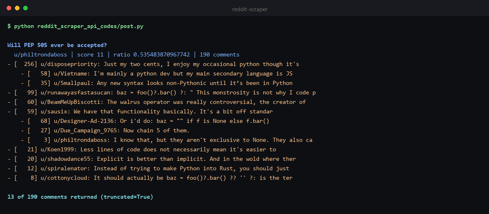
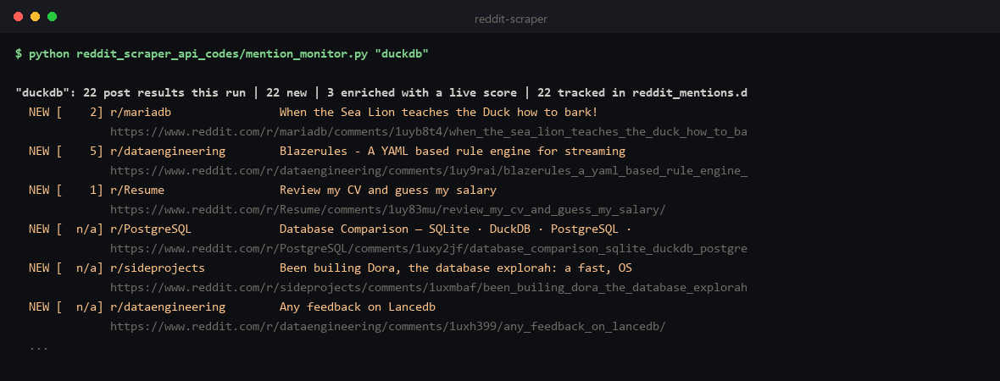

# Reddit Scraper



**Reddit Scraper for extracting posts, scores, comments, upvote ratios, subreddit listings and search results from Reddit.com.** This repo has a free Reddit web scraping script you can run right now, and a Reddit data API with 4 endpoints returning real structured JSON.

**Last updated: 2026-07-17.** Working against Reddit.com as of July 2026, and re-verified whenever Reddit changes their markup.

Every JSON block on this page was captured from the live API on 2026-07-16. Long arrays are trimmed to the first item or two and each block says exactly what was cut; the fields shown are verbatim. Full uncut samples are committed in [`reddit_scraper_api_data/`](reddit_scraper_api_data). Every code example calls the actual API and is runnable from [`reddit_scraper_api_codes/`](reddit_scraper_api_codes).

```bash
pip install requests
export CHOCODATA_API_KEY="your_key"     # free: 1,000 requests, one-time, no card
python reddit_scraper_api_codes/subreddit.py
```

Those three lines return this, live from Reddit.com:

```json
{
  "id": "t3_1uuuf9c",
  "title": "Will PEP 505 ever be accepted?",
  "score": 11,
  "num_comments": 190,
  "upvote_ratio": 0.535483870967742,
  "awards": 0,
  "author": "philtrondaboss",
  "author_id": "t2_8k02pahq",
  "subreddit": "Python",
  "permalink": "https://www.reddit.com/r/Python/comments/1uuuf9c/will_pep_505_ever_be_accepted/",
  "external_url": null,
  "domain": "self.Python",
  "created": "2026-07-12T23:04:35.157000+0000"
}
```

That is one post object, complete, all 13 fields, nothing cut. A score of 11 with a `0.535` upvote ratio and 190 comments is not a flop, it is a fight: roughly half the voters disagreed with the other half and then argued about it 190 times. You cannot see that from the score alone, which is why the ratio is in there.

...multiplied by 24 posts, with 13 fields each:



That is the whole point of this repo. Everything below is the reference: the free script, what Reddit does to it, and then each endpoint with its parameters and a real response.

---

## Contents

- [Free Reddit Scraper](#free-reddit-scraper)
- [Avoid getting blocked when scraping Reddit](#avoid-getting-blocked-when-scraping-reddit)
  - [Using the Chocodata Reddit Scraper API](#using-the-chocodata-reddit-scraper-api)
- [Reddit Scraper API reference](#reddit-scraper-api-reference)
  - [Quickstart](#quickstart) · [Authentication](#authentication) · [Global parameters](#global-parameters) · [Errors](#errors) · [Rate limits and concurrency](#rate-limits-and-concurrency)
  - [1. Subreddit](#1-subreddit-post-listings-scores-and-upvote-ratios) · [2. Post](#2-post-full-post-data-and-the-nested-comment-tree) · [3. Search](#3-search-reddit-search-results-by-keyword) · [4. User](#4-user-public-submissions-and-comments)
- [Track brand mentions across subreddits](#track-brand-mentions-across-subreddits)
- [Measured latency](#measured-latency)

---

## Free Reddit Scraper

Reddit renders a JSON view of any listing if you append `.json` to the URL. No key, no OAuth app, no cost. It is the first thing everybody tries, so it is the first thing in this repo:

```bash
python free_scraper/reddit_free_scraper.py Python
```

Source: [`free_scraper/reddit_free_scraper.py`](free_scraper/reddit_free_scraper.py). It requests `https://www.reddit.com/r/{sub}/hot.json`, walks to `data.children[].data`, and emits `id, title, score, num_comments, upvote_ratio, author, created_utc, permalink`.

It parses **first** and only reports a block when the data is genuinely absent. A page can mention "blocked" in its own JavaScript and still hand you 25 perfectly good posts, so string-matching the body before parsing it would manufacture a failure that never happened. If posts come back, the script prints them and exits 0.

After running the command, your terminal should look something like this:



No posts come back. The next section is why.

## Avoid getting blocked when scraping Reddit

We ran exactly that script from a residential connection while writing this README, 4 times. All 4 returned the same thing:

| What we measured | Value |
|---|---|
| HTTP status | **403** |
| Response size | **189,908 bytes** |
| `Content-Type` | **`text/html`** (from a URL ending in `.json`) |
| JSON parse | **failed** (the body is not JSON) |
| posts | **0** |
| Attempts blocked | **4 of 4** |

`old.reddit.com/r/Python/hot.json` is more direct about it: HTTP 403, 1,522 bytes, `<title>Blocked</title>`, and the body reads "Your request has been blocked due to a network policy."



Note what is **not** happening here, because it is the opposite of most scraping targets: Reddit is not pretending. There is no 200-that-is-really-a-block, no fake results page. You get a straight 403. The trap is subtler:

| What bites you | Why | What it costs you |
|---|---|---|
| **HTML from a `.json` URL** | The 403 body comes back as `text/html`, 190 KB of it. A naive `r.json()` **raises** rather than returning an empty list. | Your error handler catches a `JSONDecodeError` and logs "bad JSON", so you go debugging your parser instead of your access. |
| **It is not a `User-Agent` problem** | We tried a plain client UA, a Chrome UA, and a descriptive script UA. All three got the identical 403 and identical byte count. | You cannot header your way in. Reddit's own terms say to use the OAuth token and **not** to "misrepresent or mask either the user agent or OAuth identity" ([Data API Terms](https://redditinc.com/policies/data-api-terms) 2.8). |
| **Datacenter IPs are pre-blocked** | AWS, GCP and Azure ranges are well known. This is why a script that worked on your laptop last year dies the moment it moves to CI. | Clean IP supply is a recurring bill, not a one-off fix. |
| **The open surfaces have no vote data** | Reddit's `.rss` feeds stay reachable without a key, which looks like a win until you notice they carry no `score`, no `upvote_ratio` and no `num_comments`. | You ship a "working" scraper that silently cannot answer the only question you had: is this post big or not? |
| **Limits are Reddit's call, not a published constant** | "Reddit may set and enforce limits on your use of the Data APIs ... in our sole discretion" ([Data API Terms](https://redditinc.com/policies/data-api-terms) 2.9). | Capacity you cannot plan against, and terms that can move under you. |

Reddit is genuinely different from most scraping targets here: **the popular free Reddit scrapers on GitHub are mostly not scrapers at all.** [URS](https://github.com/JosephLai241/URS) (1,008 stars, last pushed 2026-07-11, actively maintained) is built on PRAW and talks to Reddit's **official API** using an OAuth app you register yourself. It does not hit the wall above because it is not going through the front door at all.

The scrapers that do what the script above does, with no key, are the ones that meet the 403: [yars](https://github.com/datavorous/yars) advertises "without API keys" and was last pushed 2025-07-07. We measured the no-key route, not that specific repo, so take that as context rather than a verdict on it.

---

### Using the Chocodata Reddit Scraper API

The managed option, and the one this repo is built around: the [Chocodata Reddit Scraper API](https://chocodata.com/scraper-api/reddit?utm_source=github&utm_medium=repo&utm_campaign=reddit-scraper). Four endpoints for Reddit data extraction at scale (subreddit listings with real vote data, posts with their nested comment threads, search, and public user feeds), a ~99% success rate against the bot check, and no OAuth app to register. Free for the first 1,000 requests.

---

## Reddit Scraper API reference

The Reddit Scraper API reference starts here: authentication, the global parameter, the error bodies, then one section per endpoint. No login and no OAuth app.

### Quickstart

```bash
curl "https://api.chocodata.com/api/v1/reddit/subreddit?api_key=YOUR_KEY&subreddit=Python"
```

```python
import requests

r = requests.get(
    "https://api.chocodata.com/api/v1/reddit/subreddit",
    params={"api_key": "YOUR_KEY", "subreddit": "Python"},
    timeout=90,
)
top = r.json()["posts"][0]
print(top["title"], top["score"], top["num_comments"])
# Thursday Daily Thread: Python Careers, Courses, and Furthering Education! 4 1
```

After running the command, your terminal should look something like this:



Get a key at chocodata.com (1,000 requests, one-time, no card).

### Authentication

Pass `api_key` as a query parameter on every request. That is the whole auth model. There is no OAuth handshake, no app registration, and no token refresh.

### Global parameters

| Param | Type | Required | Default | Description |
|---|---|---|---|---|
| `api_key` | string | **yes** | - | Your Chocodata API key. |

That is the only global parameter these endpoints take. Everything else is per-endpoint and documented below. Unknown query params are ignored rather than rejected, so a typo in an optional param name fails quietly: check your spelling against the tables below.

Each request costs **5 credits (= 1 request)**. Responses are billed only on success (2xx).

### Errors

Nothing below is billed: **you are only charged on a 2xx**.

| Status | `error` code | Meaning | Billed | What to do |
|---|---|---|---|---|
| `400` | `invalid_params` | A required param is missing or the wrong type. Body lists the exact issue and `path`. | no | Fix the query string. |
| `401` | `INVALID_API_KEY` | Key missing, unrecognised, or revoked. | no | Check `api_key`. Get one at chocodata.com. |
| `402` | `INSUFFICIENT_CREDITS` | Balance exhausted. | no | Top up ($0.90 / 1,000 requests, never expires) or upgrade. |
| `404` | `item_not_found` | The post/user does not exist, was removed, or the input could not be resolved. `retryable: false`. | no | Fix the id. Retrying will not help. |
| `429` | `RATE_LIMITED` | Over your plan's concurrency. | no | Back off and retry; see [Rate limits](#rate-limits-and-concurrency). |
| `502` | `extraction_failed` / `target_unreachable` | Reddit refused every attempt, or the subreddit does not exist. `retryable: true`. | no | Retry. This is the case the free scraper hits permanently. |

Two response shapes exist: auth/billing errors nest under `error.code` (uppercase), while scrape-layer errors are flat with a lowercase `error` string plus `retryable`. Both are shown below.

The scripts in this repo map every documented status onto an actionable message, so a typo'd key does not hand you a stack trace:



A bad key, verbatim:

```bash
curl "https://api.chocodata.com/api/v1/reddit/subreddit?api_key=totally_invalid_key_123&subreddit=Python"
```
```json
{"error":{"code":"INVALID_API_KEY","message":"Api key not recognised."}}
```

A missing required param, verbatim. Note it names the exact `path` that is wrong:

```json
{
  "error": "invalid_params",
  "issues": [
    {
      "code": "invalid_type",
      "expected": "string",
      "received": "undefined",
      "path": ["subreddit"],
      "message": "Required"
    }
  ]
}
```

An unresolvable post, verbatim:

```json
{
  "error": "item_not_found",
  "message": "reddit.post: a subreddit is required (pass a full post URL or add subreddit alongside post_id). The svc-comments surface is keyed by /r/{sub}/.",
  "retryable": false
}
```

### Rate limits and concurrency

There is no per-minute request cap. The limit is **concurrency**: how many requests you may have in flight at once.

| Plan | Concurrent requests |
|---|---|
| Free | 10 |
| Vibe | 30 |
| Pro | 50 |
| Custom | 100 to 500+ |

Exceed it and you get `429`, not a queue. Every endpoint is a **synchronous GET**: there is no webhook, callback, or async job to poll. A `/reddit/post` request can take ~20s at the high end (see [Measured latency](#measured-latency)), which is why the examples use `timeout=90`.

Sizing: at Pro (50 concurrent) and a ~2.5s median subreddit call, one worker pool sustains roughly 50 / 2.5 = **20 requests/second**. Fan out with a thread pool:

```python
from concurrent.futures import ThreadPoolExecutor
import requests

def one(sub):
    r = requests.get("https://api.chocodata.com/api/v1/reddit/subreddit",
                     params={"api_key": KEY, "subreddit": sub}, timeout=90)
    return sub, (r.json().get("posts", []) if r.ok else [])

subs = ["Python", "programming", "webscraping", "dataengineering", "MachineLearning"]
with ThreadPoolExecutor(max_workers=10) as pool:   # <= your plan's concurrency
    for sub, posts in pool.map(one, subs):
        print(sub, len(posts))
```

---

### 1. Subreddit: post listings, scores and upvote ratios

A subreddit's post listing with real vote data: score, comment count, upvote ratio and awards per post.

| Param | Type | Required | Default | Description |
|---|---|---|---|---|
| `subreddit` | string | **yes** | - | Subreddit name, with or without a leading `r/`. |
| `sort` | `hot` \| `new` \| `top` \| `rising` \| `controversial` | no | `hot` | Listing sort. |
| `t` | `hour` \| `day` \| `week` \| `month` \| `year` \| `all` | no | - | Time window. Only meaningful for `top` and `controversial`. |
| `after` | string | no | - | Pagination cursor from a previous response. See the note below. |
| `limit` | int (1-75) | no | `25` | Max posts to return, though the upstream page holds ~24. See the note below. |

```bash
curl "https://api.chocodata.com/api/v1/reddit/subreddit?api_key=YOUR_KEY&subreddit=Python"
```

**Real response.** `posts` is cut to 1 of 24; the post object itself is complete, all 13 fields verbatim ([full sample](reddit_scraper_api_data/subreddit.json)):

```json
{
  "subreddit": "Python",
  "sort": "hot",
  "t": null,
  "after_cursor": null,
  "total_results": 24,
  "posts": [
    {
      "id": "t3_1uxmsnj",
      "title": "Thursday Daily Thread: Python Careers, Courses, and Furthering Education!",
      "score": 4,
      "num_comments": 1,
      "upvote_ratio": 0.6666666666666666,
      "awards": 0,
      "author": "AutoModerator",
      "author_id": "t2_6l4z3",
      "subreddit": "Python",
      "permalink": "https://www.reddit.com/r/Python/comments/1uxmsnj/thursday_daily_thread_python_careers_courses_and/",
      "external_url": null,
      "domain": "self.Python",
      "created": "2026-07-16T00:00:08.298000+0000"
    }
  ],
  "_source": "shreddit"
}
```

`upvote_ratio` is the field most people come for and the one the free surfaces cannot give you: `score` alone cannot distinguish a quiet consensus from a brawl. `external_url` is `null` on all 24 posts in this sample because r/Python is a self-post subreddit, and `domain` reads `self.Python` accordingly: on a link subreddit those two carry the outbound URL and its host. `_source: "shreddit"` tells you the response came off the surface that carries vote data (see the search endpoint for what it looks like when that is not true).

Five behaviours to code against:

- **Treat this as a single-page endpoint: ~24 to 25 posts per call.** `after_cursor` came back `null` on **22 of 23** listings we captured, across r/Python, r/programming, r/webscraping and r/news on `hot`, `new` and `top`. The `after` param is accepted, but on the surface that normally answers there is no cursor coming back to feed it.
- **`_source` is worth reading, and `total_results` is not always ~24.** The 23rd call above is the interesting one: it fell back to a secondary surface (`_source: "shreddit-ireddit"`), and that response *did* carry an `after_cursor`, but it returned **3 posts instead of 24**. So a thin result is a real outcome, not a quiet subreddit. Check `total_results` and `_source` rather than assuming a full page, and re-request if you got the short one.
- **`limit` above ~24 does nothing.** The upstream page holds about 24 posts. We asked for 50 and 75 and got 24 both times.
- **`rising` is not a distinct ranking.** On r/news, r/AskReddit and r/programming it returned the **identical 24-post set** as `hot` (24/24 overlap on all three). Treat it as an alias of `hot` rather than a rising feed. `new` is genuinely different (0/24 overlap with `hot` on r/AskReddit).
- **`top` and `controversial` need `t`.** Without a time window, `top` on r/Python returned 2 posts. With `t=all` it returned 24, topping out at a score of 12,342.

Runnable: [`reddit_scraper_api_codes/subreddit.py`](reddit_scraper_api_codes/subreddit.py)

---

### 2. Post: full post data and the nested comment tree

One post plus its comment thread, nested, with a real score on every comment.

| Param | Type | Required | Default | Description |
|---|---|---|---|---|
| `post_id` | string | one of `post_id`/`url` | - | Post id, with or without the `t3_` prefix (e.g. `1uuuf9c`). |
| `url` | string (URL) | one of `post_id`/`url` | - | Any full Reddit post URL. |
| `subreddit` | string | with `post_id` | - | Subreddit the post lives in. **Case-sensitive, see below.** |
| `sort` | `top` \| `new` \| `controversial` | no | `top` | Comment sort. |

```bash
curl "https://api.chocodata.com/api/v1/reddit/post?api_key=YOUR_KEY&post_id=1uuuf9c&subreddit=Python"
```

**Real response.** All 13 fields of the `post` object are present and verbatim, **except `body`, which is truncated where marked** (161 of its 567 characters are shown, purely for page width; the full string is in the sample). `comments` is cut to 1 root of 9 (and that root's `replies` to 1 of 2) out of the 13 returned; the comment objects are complete and verbatim ([full sample](reddit_scraper_api_data/post.json)):

```json
{
  "post": {
    "id": "t3_1uuuf9c",
    "title": "Will PEP 505 ever be accepted?",
    "author": {
      "username": "philtrondaboss",
      "id": "t2_8k02pahq"
    },
    "score": 11,
    "upvote_ratio": 0.535483870967742,
    "num_comments": 190,
    "created": "2026-07-12T23:04:35.157000+0000",
    "body": "https://peps.python.org/pep-0505/ I don't understand how null safe operators are less like plain English than other implemented features like the walrus operator...",
    "permalink": "https://www.reddit.com/r/Python/comments/1uuuf9c/will_pep_505_ever_be_accepted/",
    "external_url": null,
    "domain": "self.Python",
    "is_locked": null,
    "is_removed": null
  },
  "comments": [
    {
      "id": "t1_ox6854j",
      "parent_id": null,
      "depth": 0,
      "score": 256,
      "author": {
        "username": "disposepriority",
        "id": null
      },
      "body": "Just my two cents, I enjoy my occasional python though it's not my primary language and that looks very unpythonic in my eyes. Most certainly not easier to read in any way, though I am a verbose/explicit code preference kinda guy.",
      "created": "2026-07-12T23:10:38.774000+0000",
      "permalink": "https://www.reddit.com/r/Python/comments/1uuuf9c/comment/ox6854j/",
      "replies": [
        {
          "id": "t1_ox693jc",
          "parent_id": "t1_ox6854j",
          "depth": 1,
          "score": 58,
          "author": {
            "username": "Vietname",
            "id": null
          },
          "body": "I'm mainly a python dev but my main secondary language is JS, and im just fine keeping this out of python. It's useful when im writing JS, but its hard to parse when im reading someone else's code compared to the more verbose python equivalent.",
          "created": "2026-07-12T23:16:01.012000+0000",
          "permalink": "https://www.reddit.com/r/Python/comments/1uuuf9c/comment/ox693jc/",
          "replies": []
        }
      ]
    }
  ],
  "comments_returned": 13,
  "_meta": {
    "source": "svc-comments+post-page",
    "sort": "top",
    "pages_fetched": 2,
    "truncated": true
  }
}
```

The tree is genuinely nested rather than flattened: `parent_id` and `depth` are real, and `replies` recurses, so a 256-score top comment and the 58-score reply arguing with it stay attached to each other. `author.id` is `null` on comments (the comment surface does not carry the author's `t2_` id) while the post's `author.id` is populated, and `is_locked`/`is_removed` are `null` rather than `false`, meaning unknown: the surface did not carry a value either way.

Running it:



Four behaviours to code against:

- **You get the top of the thread.** `comments_returned` was **13 of 190** here, and `_meta.truncated` was `true` on **every single call we made**, across 6 posts with 29 to 246 comments each (we saw 11 to 15 comments returned). Read `_meta.truncated` and `num_comments` to know where you stand.
- **`subreddit` is case-sensitive, and getting it wrong fails quietly.** `subreddit=python` returns **HTTP 200 with `title`, `score`, `author` and `body` all `null`** while the comment tree arrives normally. `subreddit=Python` returns the full post. We reproduced this 4 out of 4 times in each direction, and the same applies in reverse (`Programming` fails where `programming` works). Pass the subreddit exactly as Reddit spells it, or pass the full post `url` and let it sort itself out.
- **The post object is best-effort.** Even with the right casing it comes from a second fetch that can miss: we saw it return `null` once in roughly two dozen calls. The comment tree and `num_comments` always arrived. If `post.title is None`, retry.
- **A dead post id returns 200, not 404.** `post_id=zzzzzzz` gives an all-null post stub with `num_comments: 0`. Check `post.title is None` rather than trusting the status code.

Runnable: [`reddit_scraper_api_codes/post.py`](reddit_scraper_api_codes/post.py)

---

### 3. Search: Reddit search results by keyword

Reddit's own search, site-wide or restricted to one subreddit.

| Param | Type | Required | Default | Description |
|---|---|---|---|---|
| `q` | string | **yes** | - | Search query. |
| `subreddit` | string | no | - | Restrict the search to one subreddit. |
| `sort` | `relevance` \| `hot` \| `top` \| `new` \| `comments` | no | `relevance` | Sort order. |
| `t` | `hour` \| `day` \| `week` \| `month` \| `year` \| `all` | no | - | Time window. |
| `limit` | int (1-25) | no | `25` | Max results. |

```bash
curl "https://api.chocodata.com/api/v1/reddit/search?api_key=YOUR_KEY&q=web%20scraping"
```

**Real response.** `results` is cut to 2 of 25 (one of each `result_type`); both objects are complete and verbatim, and `_rss_limitations` is shown in full because it is the important part ([full sample](reddit_scraper_api_data/search.json)):

```json
{
  "query": "web scraping",
  "subreddit": null,
  "sort": "relevance",
  "t": null,
  "total_results": 25,
  "results": [
    {
      "position": 1,
      "id": "t5_318ly",
      "short_id": "318ly",
      "result_type": "subreddit",
      "title": "webscraping",
      "author": null,
      "author_url": null,
      "subreddit": null,
      "permalink": "https://www.reddit.com/r/webscraping/",
      "external_url": null,
      "created": null,
      "score": null,
      "num_comments": null
    },
    {
      "position": 4,
      "id": "t3_1tbuq4g",
      "short_id": "1tbuq4g",
      "result_type": "post",
      "title": "The Complete Web Scraping & Anti-Bot Bypass Guide 2026",
      "author": "pimterry",
      "author_url": "https://www.reddit.com/user/pimterry",
      "subreddit": "webscraping",
      "permalink": "https://www.reddit.com/r/webscraping/comments/1tbuq4g/the_complete_web_scraping_antibot_bypass_guide/",
      "external_url": "https://asadfix.github.io/scraping-guide/",
      "created": "2026-05-13T09:39:29+00:00",
      "score": null,
      "num_comments": null
    }
  ],
  "_source": "rss",
  "_rss_limitations": {
    "surface": "rss-atom",
    "unavailable_fields": [
      "score",
      "ups",
      "downs",
      "upvote_ratio",
      "num_comments",
      "awards",
      "total_awards_received",
      "author_karma",
      "author_cake_day",
      "flair"
    ],
    "note": "This response used the .rss/Atom fallback (the shreddit HTML surface that carries vote data was unreachable on this request). RSS does not expose any vote/award/comment counts or author karma - those fields are null (not fabricated). Identity, author, timestamps, permalinks, post/comment bodies ARE provided."
  }
}
```

`score` and `num_comments` are `null` on **every search result**, always, not just this one. `_source: "rss"` says why, and `_rss_limitations` lists the ten fields that surface cannot carry. Search tells you **what and where**, not **how big**: if you need the score, take the `id` and `subreddit` from the result and spend one `/reddit/post` call on it. That is exactly what [`mention_monitor.py`](reddit_scraper_api_codes/mention_monitor.py) does, and [tracking brand mentions](#track-brand-mentions-across-subreddits) below shows it working.

Also note `result_type`: 3 of these 25 results are `subreddit` rows (communities matching the query), not posts. Filter on `result_type == "post"` before you count anything, or your "22 mentions" becomes 25.

Runnable: [`reddit_scraper_api_codes/search.py`](reddit_scraper_api_codes/search.py)

---

### 4. User: public submissions and comments

A public user's recent submissions and comments. This example uses u/spez, Reddit's CEO, whose account is public by definition.

| Param | Type | Required | Default | Description |
|---|---|---|---|---|
| `username` | string | **yes** | - | Username, with or without a leading `u/`. |
| `kind` | `overview` \| `submitted` \| `comments` | no | `overview` | Which slice of the profile feed. |
| `limit` | int (1-25) | no | `25` | Max items. |

```bash
curl "https://api.chocodata.com/api/v1/reddit/user?api_key=YOUR_KEY&username=spez"
```

**Real response.** `items` is cut to 1 of 25, and `_rss_limitations` is omitted here because it repeats the search block above (same three keys, same ten `unavailable_fields`; its `note` adds two sentences about karma and cake-day, quoted in the note below). The profile and item objects are complete and verbatim ([full sample](reddit_scraper_api_data/user.json)):

```json
{
  "profile": {
    "username": "spez",
    "profile_url": "https://www.reddit.com/user/spez",
    "bio": "Reddit CEO",
    "icon": "https://www.redditstatic.com/icon.png/",
    "title": "overview for spez",
    "total_karma": null,
    "created": null
  },
  "total_results": 25,
  "items": [
    {
      "type": "comment",
      "id": "t1_os0o1vi",
      "short_id": "os0o1vi",
      "title": "/u/spez on 21 years of Reddit",
      "subreddit": "u/spez",
      "body": "And thank you (mod tools suck) u/shiruken !",
      "external_url": null,
      "permalink": "https://www.reddit.com/r/u_spez/comments/1u7hraf/21_years_of_reddit/os0o1vi/",
      "created": "2026-06-16T16:59:58+00:00",
      "score": null
    }
  ],
  "_source": "rss"
}
```

`kind` does what it says: `overview` returned 21 comments plus 4 submissions, `submitted` returned 22 submissions, `comments` returned 25 comments.

Same surface as search, same consequence: `score` is `null` on every item, and `profile.total_karma` and `profile.created` are `null` too. The response says so itself, in the two sentences its `_rss_limitations.note` adds over the search version: "Profile karma and cake-day are not in the user RSS feed (null). The feed returns the user's most recent public items only." So you get the **most recent ~25 public items**, with no pagination and no history.

Runnable: [`reddit_scraper_api_codes/user.py`](reddit_scraper_api_codes/user.py)

---

## Track brand mentions across subreddits

Knowing when somebody mentions your product, while the thread is still live enough to reply to, is the main commercial reason to scrape Reddit. So that use case is in the repo end to end rather than as a snippet. [`mention_monitor.py`](reddit_scraper_api_codes/mention_monitor.py) searches for a keyword, stores every observation as a local dataset in SQLite (export it to CSV with one `sqlite3` command), enriches the newest hits with a real score via `/reddit/post`, and prints only what is new since the last run:

```bash
python reddit_scraper_api_codes/mention_monitor.py "duckdb"
```



That is a real first run: 22 post results, all 22 new because the database was empty, and the newest 3 enriched with a live score. Run it again and you get the other half of the loop, verbatim:

```
"duckdb": 22 post results this run | 0 new | 0 enriched with a live score | 22 tracked in reddit_mentions.db

No new mentions since the last run. Schedule it (cron / GitHub Actions) and
this becomes a feed of every new Reddit thread that names your keyword.
```

The `n/a` scores in that screenshot follow from the search surface: it cannot return a score (see [the search endpoint](#3-search-reddit-search-results-by-keyword)), so the script only spends a `/reddit/post` call on the newest few and leaves the rest unscored. Raise `--enrich` and you trade requests for coverage.

One request per run for the search, plus one per post you enrich. 1,000 free requests covers roughly a month of hourly checks on one keyword with light enrichment.

---

## Measured latency

Real end-to-end wall-clock, measured from a laptop against the live API on 2026-07-16. This includes the upstream fetch, the anti-bot handling, and the parse:

| Endpoint | Median | Range | n |
|---|---|---|---|
| `/reddit/subreddit` | 2.5s | 1.7 to 3.2s | 5 |
| `/reddit/post` | 5.4s | 3.0 to 19.5s | 12 |
| `/reddit/search` | 3.0s | 1.7 to 8.2s | 5 |
| `/reddit/user` | 2.5s | 1.6 to 9.1s | 5 |

Read the ranges, not just the medians. `/reddit/post` is the slow one on purpose: it fetches the comment thread and the post page, so it pays for two upstream round trips where the others pay for one. The 19.5s high end is a request that ran into Reddit's bot check and was re-attempted until it came back with real data. Absorbing that, silently, is the thing you are actually buying: the free script in this repo hits the same wall and simply stops. Small sample (n=5 to 12); reproduce it yourself with the scripts here.

---

## License

MIT. See [LICENSE](LICENSE).
